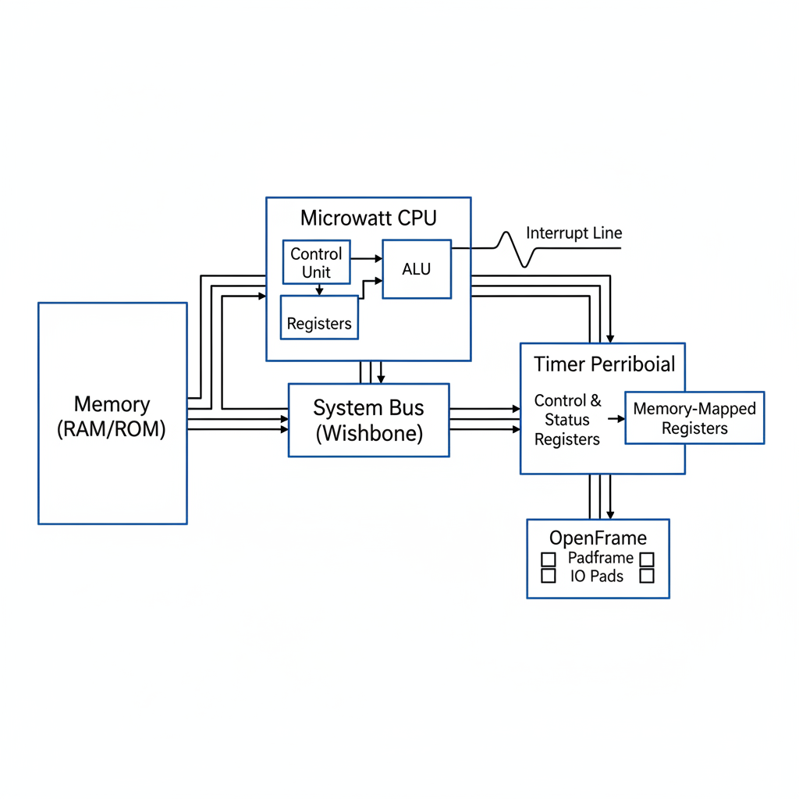

# Proposal: Timer Peripheral with Interrupt and Auto-Reload for Microwatt CPU

## Project Summary

This project aims to integrate a memory-mapped timer peripheral with the Microwatt POWER CPU, implemented using the ChipFoundry OpenFrame template. The timer will support auto-reload (periodic) mode as well as interrupt generation. This is a typical SoC enhancement, useful for timing, delays, task scheduling, and system tick generation in embedded applications.

## Motivation

Timers are essential for most digital systems, especially where precise timekeeping or regular interval events are required. Adding a simple, efficient timer block that can trigger an interrupt and operate in both one-shot and periodic modes greatly extends the utility of the Microwatt core for real-world use cases. This serves as a foundational block for operating systems, bare-metal firmware, or any applications that need alarms or routine scheduling.

## Core Features

- 32-bit timer, memory-mapped for register access
- Configurable reload value for periodic operation
- Support for both one-shot and auto-reload (periodic) modes
- Generates interrupt request to the CPU on timer expiry
- Basic status and control registers (start/stop, mode select, interrupt flag)

## High-Level Block Diagram

*The timer peripheral connects to the Microwatt CPU via the system bus for register access and emits an interrupt signal on expiry. The reload and control logic enables periodic or one-shot operation.*

## Implementation Outline

- Adapt the OpenFrame user project template to instantiate and connect the timer block
- Define register map (counter, control, reload, status)
- Integrate interrupt output to CPU interrupt line
- Develop simple testbench for timer operation (including auto-reload and interrupt cases)
- Document register interface and provide example usage scenario

## Expected Outcome

A lightweight Verilog design that demonstrates a functional, extensible timer peripheral for the Microwatt CPU, suitable for inclusion in future SoC developments or course projects.
